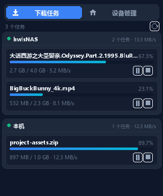
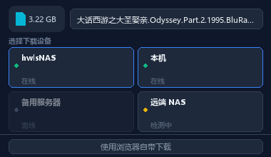

# Down2Aria2s

**多设备 Aria2 下载分发器** —— 在浏览器中拦截下载，将任务一键分发到你配置的任意一台 Aria2 服务器，并实时显示各设备的在线状态与下载进度。

---

## ✨ 功能特性

- 🖥️ **多设备管理**：可配置多台 Aria2 服务器（本地 / 远程 / 带 Token 鉴权），统一在「设备管理」页维护。
- 🟢 **在线状态探测**：以真实 RPC 探测为准（`aria2.tellActive` 兜底），不再误报离线。
- 📊 **实时进度监控**：分设备展示活跃下载任务、进度、速度、剩余时间。
- 🛑 **可靠的取消 / 暂停**：调用 `forceRemove` / `forcePause`，并对失败做确定性校验与提示，确保「点了就真的停」。
- 🌐 **多语言**：内置中文（`default_locale`）与英文。
- 🎨 **现代界面**：基于 SolidJS + Tailwind CSS，深色主题。

---

## 📸 截图




---

## 🚀 安装方式

### 方式一：Chrome 网上应用店（推荐普通用户）
在 [Chrome 网上应用店](https://chrome.google.com/webstore) 搜索 **Down2Aria2s** 并安装（上架后提供链接）。

### 方式二：加载已解压的扩展（开发者 / 自托管）
1. 拉取本仓库并安装依赖、构建：
   ```bash
   npm install
   npm run build          # 调试构建（含 sourcemap）
   # 或生产构建（不含 sourcemap，体积更小）
   PROD_RELEASE=1 npm run build
   ```
2. 打开 `chrome://extensions`，开启「开发者模式」。
3. 点击「加载已解压的扩展程序」，选择构建产物目录 `dist/`。
4. 点击扩展图标，在「设备管理」中添加你的 Aria2 服务器地址（如 `http://127.0.0.1:6800/jsonrpc`，按需填写 Token）。

---

## 🛠 构建说明

构建由三段 Vite 配置组成，最后由 `build.js` 合并到 `dist/`：

| 配置 | 产物 |
| --- | --- |
| `vite.popup.config.ts` | 弹窗 `index.html` + `js/`、`css/` |
| `vite.confirm.config.ts` | 确认弹窗 `confirm/` |
| `vite.background.config.ts` | 后台 Service Worker `background.js` |

```bash
npm install
npm run build                 # 调试版（sourcemap: on）
PROD_RELEASE=1 npm run build  # 发布版（sourcemap: off）
```

发布包即 `dist/` 目录的全部内容，压缩为 zip 后即可上传 Chrome 网上应用店。

---

## 🔐 权限说明（上架审核用）

| 权限 | 用途 |
| --- | --- |
| `downloads` | 拦截浏览器下载行为，接管下载任务 |
| `storage` | 保存设备配置与用户偏好 |
| `cookies` | 将所需 Cookie 一并转发给 Aria2 服务端以完成鉴权下载 |
| `host_permissions: <all_urls>` | 向用户自定的任意 Aria2 地址发起 JSON-RPC 请求 |

本扩展**单用途**明确：仅用于把下载任务转发到用户自己配置的 Aria2 服务器。所有数据仅在「发起下载的当下」使用，不存储、不上传第三方。详见 [PRIVACY.md](./PRIVACY.md)。

---

## 📁 目录结构

```
Down2Aria2s/
├── index.html              # 弹窗入口
├── confirm/                # 确认弹窗页面
├── src/                    # 主逻辑（SolidJS）
│   ├── App.tsx             # 设备/任务管理、轮询、RPC 调用
│   ├── background.tsx      # Service Worker
│   ├── util.tsx            # Aria2 JSON-RPC 封装（含错误校验）
│   ├── CreateServer.tsx    # 设备添加/编辑
│   └── Selector.tsx
├── public/                 # manifest、图标、_locales
├── build.js                # 合并三段构建产物到 dist/
├── vite.*.config.ts        # 三段 Vite 配置
└── dist/                   # 最终扩展产物（构建生成）
```

---

## 📜 开源协议

[MIT](./LICENSE)
